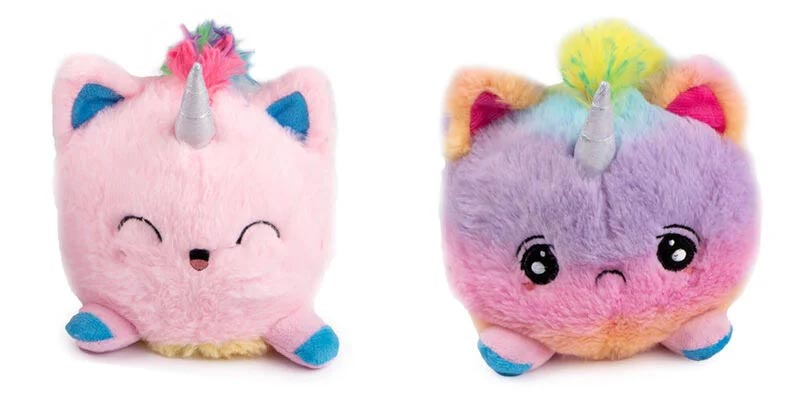
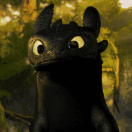

# A Beginner's Guide to Teachable Machine

<figure>
  
  <figcaption style="text-align: center;"><a href="https://xkcd.com/1425/">xkcd #1425: Tasks</a> - <i>24 Sept 2014</i></figcaption>
</figure>

> In 2015 the idea of creating a computer system that could recognise birds was considered so outrageously challenging that it was the basis of this XKCD joke.
>
> ― From <cite>[Is it a bird? Creating a model from your own data](https://www.kaggle.com/code/jhoward/is-it-a-bird-creating-a-model-from-your-own-data)</cite>

A decade (and countless research teams) later, creating a bird recognition model is no longer the hard task it once was. You can create your own in just a few minutes with minimal code ([following this tutorial](https://www.kaggle.com/code/jhoward/is-it-a-bird-creating-a-model-from-your-own-data)) or no code at all using tools like Teachable Machine.

## What is Teachable Machine?
[Teachable Machine](https://teachablemachine.withgoogle.com/) is a web tool developed by Google that makes it possible to create machine learning models without writing a single line of code. It aims to make creating machine learning models more accessible to a wider audience, including those who may not have a background in machine learning or programming.

## What models can you create with Teachable Machine?
Teachable Machine primarily creates classification models. Classification models are a type of machine learning models that categorise data into different classes or groups. For example, recognising different types of animals, or classifying different types of sounds.

Teachable Machine can create three types of classification models:
1. Image Classification
2. Sound Classification
3. Pose Classification (standing, sitting, raising hands, etc.)

## Example Projects using Teachable Machine
1. Bananameter ([Demo](https://tm-image-demo.glitch.me/) | [Tutorial](https://medium.com/@warronbebster/teachable-machine-tutorial-bananameter-4bfffa765866)) - A project that classifies bananas based on their ripeness.

2. Tiny Sorter ([Experiment](https://experiments.withgoogle.com/tiny-sorter/view/)) - A tangible project to sort tiny objects using Arduino, a servo motor, and a bit of paper.

## Using Teachable Machine
Once you pick the type of model you want to create, the process of creating a model with Teachable Machine is generally the same:
1. **Gather data** - Provide examples of the different classes you want to classify. For example, if you want to create a model that can classify cats and dogs, you need to provide images of cats and dogs.
2. **Train the model** - The model is trained using the data you provide.
3. **Test and export the model** - Test the model to see how well it performs, then you can export it to use it in your projects.

**Note:** All the sampling and training happens in the browser on your machine, unless you choose to upload the samples to Google Drive or export the model to Google.

### 🦄 Live Demo: Happy Unicorn, Sad Unicorn

Using a reversible unicorn plushie, we will create a model that classifies the unicorn as happy or sad.

Demo: [Unicorn Reversible Plushie](https://ccai-cdt.github.io/modelgallery/model/unicorn-plush/)

## How to Train Your Model

Your model is only as good as the data you provide. Since we are building an image classification model, most of the tips below are specific to image classification models. However, the general principles apply to other types of models as well.

1. **Use enough data** - The more examples you provide, the better the model will perform, but the slower the training process will be. Teachable Machine doesn't require a lot of data to get started, but try to provide at least 100 examples for each class for better results.
2. **Diversify your data** - Try to include a variety of examples for each class. Include examples with different characteristics, backgrounds, and lighting conditions.
3. **Balance your classes** - Try to have roughly the same number of examples for each class. An imbalanced dataset can lead to biased models.
4. **Test with new data** - After training your model, test it with new data to see how well it generalises.

## Finding Datasets
If you don't want to collect your own data, you can find datasets online. Here are a few places to find datasets:
- [Kaggle Datasets](https://www.kaggle.com/datasets)
- [Hugging Face Datasets](https://huggingface.co/datasets)
- [Google Dataset Search](https://datasetsearch.research.google.com/)

### Considerations for Using Datasets
When using datasets from external sources, consider the following:
- **License** - Make sure you have the right to use the dataset for your project.
- **Bias** - Be aware of potential biases in the dataset and how they might affect your model's performance and fairness.
- **Data Quality** - Check the quality of the data before using it. Low-quality data can lead to poor model performance.

## Your Turn
Now it's your turn to create your own Teachable Machine model. In groups or however you prefer, pick a project idea, gather data, and start training your model. You could use the objects around you, create models based on poses or hand gestures, or find a dataset online to experiment with.

If you're happy to list your project here, please export your model and/or download your dataset and share it with me.

## Resources
### General
- [Teachable Machine Website](https://teachablemachine.withgoogle.com/)
- [Teachable Machine: Approachable Web-Based Tool for Exploring Machine Learning Classification](https://dl.acm.org/doi/10.1145/3334480.3382839) - Extended Abstract from CHI 2020

### Tutorials
- [Bananameter Tutorial](https://medium.com/@warronbebster/teachable-machine-tutorial-bananameter-4bfffa765866)
- Teachable Machine Official Tutorials [Part 1](https://www.youtube.com/watch?v=DFBbSTvtpy4), [Part 2](https://www.youtube.com/watch?v=CO67EQ0ZWgA), and [Part 3](https://www.youtube.com/watch?v=n-zeeRLBgd0)
- The Coding Train's [Teachable Machine Image Classification](https://www.youtube.com/watch?v=kwcillcWOg0) and [Teachable Machine Snake Game](https://www.youtube.com/watch?v=UPgxnGC8oBU) tutorials - Using Teachable Machine models in p5.js and ml5.js
- [Is it a bird? Creating a model from your own data](https://www.kaggle.com/code/jhoward/is-it-a-bird-creating-a-model-from-your-own-data) - A python tutorial on creating bird recognition models. While it doesn't use Teachable Machine, the principles are similar, and you can follow the same steps to convert any of your Teachable Machine models to Python.
